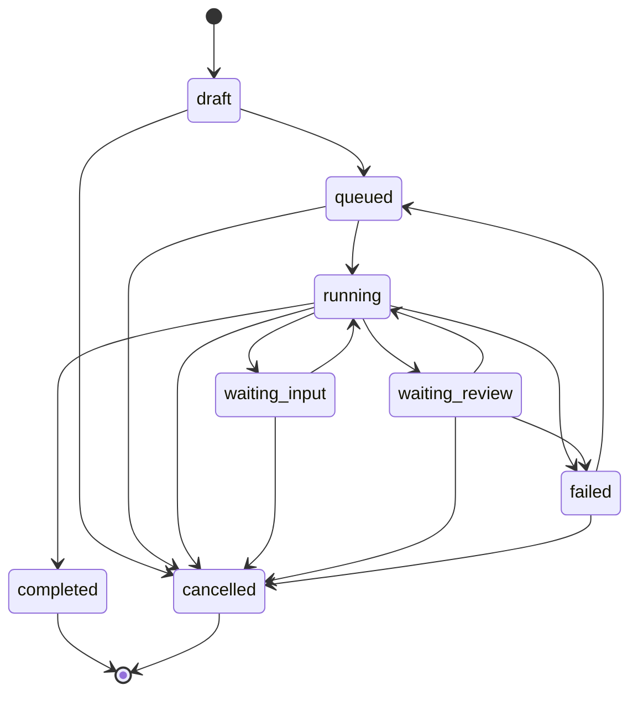
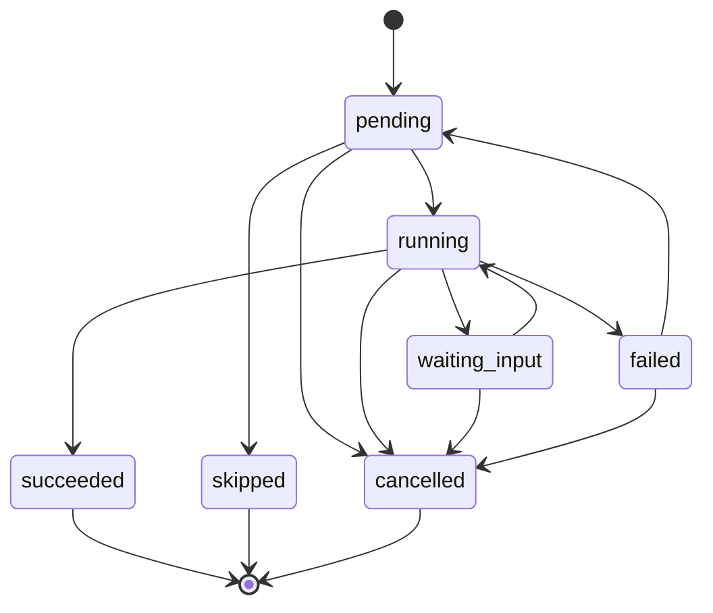

# 内容生产管线契约

## 状态

已接受，适用于内容生产改造迭代 0。

## 决策

GEOFlow 将新增独立的内容生产项目和阶段执行记录，不把生产过程状态继续扩充到 `articles.status`，也不继续扩充 `WorkerExecutionService` 承担新流程。

新管线由功能开关 `GEOFLOW_CONTENT_PRODUCTION_PIPELINE_ENABLED` 控制，默认关闭。关闭时所有现有任务继续使用原生成链路。

## 稳定契约

### 生产模式

- `guided`：关键步骤等待人工确认；
- `standard`：按规则自动推进；
- `quick`：减少可选研究与确认步骤；
- `batch`：以同一规则创建多项生产；
- `editor_assistant`：只提供编辑器局部辅助。

### 项目状态

- `draft`
- `queued`
- `running`
- `waiting_input`
- `waiting_review`
- `failed`
- `completed`
- `cancelled`

### 阶段状态

- `pending`
- `running`
- `succeeded`
- `failed`
- `skipped`
- `waiting_input`
- `cancelled`

成功、跳过和取消是终态。失败阶段只能先回到待执行状态再重试，不能直接改为成功。

### 阶段顺序

1. `initialize`
2. `duplicate_check`
3. `research`
4. `brief`
5. `title`
6. `outline`
7. `section_writing`
8. `assembly`
9. `quality_gate`
10. `targeted_repair`
11. `review`
12. `wordpress_publish`
13. `platform_rewrite`

阶段输入输出字段由 `ContentProductionWorkflow` 统一声明。阶段载荷使用 `ContentStagePayload` 信封，固定包含 `schema_version`、`stage` 和 `data`。后续数据库、队列、管理端和 API 必须引用该契约，不能各自定义另一套阶段名称。

组装阶段产生稳定键 `article_candidate`。质量检查通过时它直接进入审核；质量不通过时，定向修复用新版本更新同一稳定键。因此跳过修复不会导致审核和发布缺少输入。

## 边界

- 本迭代不新增数据库表；
- 本迭代不改变任务调度、文章生成或发布行为；
- 本迭代不接入 AI、知识库、SERP 或 WordPress；
- 本迭代的功能开关尚未接入运行时分流，即使显式开启也不会改变现有行为；
- 下一迭代在此契约上新增生产项目和阶段记录；
- 数据工厂和管线 Feature 测试基类随下一迭代的数据表一起提供；
- 旧链路在新管线完成灰度验收前保留。

## 后续约束

- 所有状态转换由领域服务执行；
- 阶段记录必须保存输入哈希、输出、模型、规则版本、尝试次数、耗时和错误；
- 数据库唯一约束和事务行锁是幂等性的最终保障；
- 外部调用不得放在长事务中；
- 后续任务必须在事务提交后派发；
- 证据需要保存内容快照和来源，不能只保存知识片段 ID。
